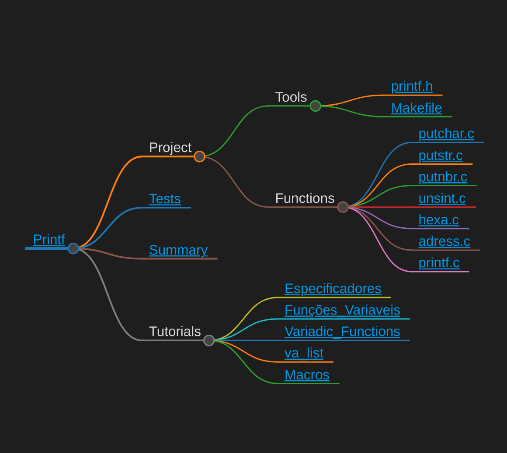

```
██████╗ ██████╗ ██╗███╗   ██╗████████╗███████╗
██╔══██╗██╔══██╗██║████╗  ██║╚══██╔══╝██╔════╝
██████╔╝██████╔╝██║██╔██╗ ██║   ██║   █████╗  
██╔═══╝ ██╔══██╗██║██║╚██╗██║   ██║   ██╔══╝  
██║     ██║  ██║██║██║ ╚████║   ██║   ██║     
╚═╝     ╚═╝  ╚═╝╚═╝╚═╝  ╚═══╝   ╚═╝   ╚═╝                                                
```

## Description
- This project is a ***printf*** re-coding of the **C** library.\
Where do I implement *variadic functions*.
  
 Skills | Grade | 
:------:|:-----:|
[Algorithms & AI] [Rigor] | **:white_check_mark: 100%**

### *Access to the [interactive map](https://faleite.github.io/42printf).*
[](https://faleite.github.io/42printf)
